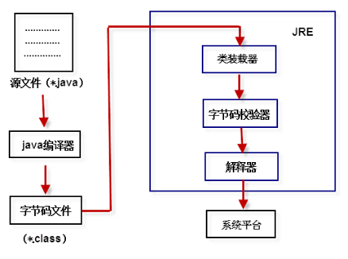

# To be Java God

真正的大师永远怀着一颗~~学徒~~学秃的心

---

**Java应用程序的运行机制**

Java是编译型和解释型的结合。编译型和容易理解，解释型主要体现在Java的字节码文件上。

源文件( *.java) -> java编译器 -> 字节码文件( *.class) -> 类装载器 -> 字节码校验器 -> 解释器 -> 系统平台



JRE 包括类装载器、字节码校验器以及解释器。JDK 包含 JRE，JRE 包含 JVM。


**命名规范**

1. 类名：首字母大写以及驼峰原则
2. 方法名和变量名：首字母小写以及驼峰原则
3. 常量名：全部大写以及用下划线组合


**变量**

1. 局部变量从属于方法或者语句块，==不会自动初始化==。所以在使用之前要记得初始化。

2. 成员变量从属于对象，也叫作实例变量。成员变量定义在方法外部、类内部并且不被``static``修饰，==会自动初始化==。

   | 变量的类型  | 自动初始化后的值 |
   | :---------: | :--------------: |
   |   ``int``   |        0         |
   | ``double``  |       0.0        |
   |  ``char``   |     '\u0000'     |
   | ``boolean`` |      false       |

3. 静态变量从属于类，也叫作类变量。静态变量使用static定义，在类内部，生命周期伴随类始终，从类加载到卸载。类存在它就存在，类不存在它就不存在。


**数据类型**

* 基本数据类型
  * 数值型
    * | 整数类型  |       所占空间        |
      | :-------: | :-------------------: |
      | ``byte``  |         1字节         |
      | ``short`` |         2字节         |
      |  ``int``  | 4字节（最大值约21亿） |
      | ``long``  |         8字节         |
    
    * |  浮点类型  | 所占空间 |
      | :--------: | :------: |
      | ``float``  |  4字节   |
      | ``double`` |  8字节   |
  * 字符型``char``：2个字节
  * 布尔型``boolean``：1位（不是1字节）
* 引用数据类型（==用来引用对象==，占4个字节的空间）
  * 类（class）
  * 接口（interface）
  * 数组（array）


整型常量的四种表示形式：

* 十进制整数
* 八进制整数，要求以 0 开头，如：015
* 十六进制数，要求以 0x 或 0X 开头，如：0x15
* 二进制数，要求 0b 或 0B 开头，如：0b01110011

整型常量默认是``int``类型，所以：

```java
long i = 36;		//Right.因为36没超过int的最大值
long globalPopulation = 7400000000;		//Error
long globalPopulation = 7400000000l;	//Right.不推荐，因为l和1会混淆
long globalPopulation = 7400000000L;	//Right.更推荐用L
```


浮点型常量默认是``double``类型，所以：

```java
float pi = 3.14;	//Error
float pi = 3.14f;	//Right
float pi = 3.14F;	//Right

float f = 3.6F;
float ff = f + 7.2;		//Error
float ff = f + 7.2F;	//Right
```

另外，浮点数不精确，所以比较时可能会出错。
若要进行浮点数的比较，请使用``java.math``包中的``BigDecimal``类进行比较。


字符型的tips：

```java
char b = 'h';
System.out.println(0 + b);		//输出104.等价于System.out.println((int)b);
```


**运算符**

1. 取模运算：

   ```java
   /*取模运算“余数”的符号和左边操作数相同*/
   a = 7 % 3;		//a = 1
   a = -7 % 3;		//a = -1
   a = 7 % -3;		//a = 1
   a = -9 % -5;	//a = -4
   ```

2. 赋值运算：

   ```java
   a *= b + 3;		//a = a * (b + 3)
   				//因为 + 运算符比 *= 运算符的优先级高
   ```

3. 字符==串==连接符：

   ```java
   System.out.println(3 + "4");		//输出34
   System.ouy.println(3 + '4');		//输出55
   System.out.println(4 + 5 + "3");	//输出93
   ```

   

**方法**

关于方法中参数的传递：

* 基本类型传递的是该数据值的copy值
* 引用类型传递的是该对象引用的copy值，但指向的是同一个对象。


**重载**

要完整地描述一个方法， 需要指出==方法名以及参数类型。这叫做方法的签名（signature)==。例如， String 类有 4 个 称为 indexOf 的公有方法。它们的签名是 
indexOf(int) 
indexOf(int, int) 
indexOf(String) 
indexOf(String, int) 
返回类型不是方法签名的一部分。也就是说， 不能有两个名字相同、 参数类型也相同却返回不同类型值的方法。同样的，==访问修饰符也不是方法签名的一部分==。

* 只是返回类型不同或访问修饰符不同或返回类型和访问修饰符不同，不构成重载，编译器报错
* 方法名相同，参数列表的参数个数不同、参数类型不同、参数顺序不同都可构成重载


**递归**

**人理解迭代，神理解递归**

递归结构包括两个部分：

1. 定义递归头。解答：什么时候不调用自身方法。如果没有头，将陷入死循环，也就是递归的结束条件。
2. 递归体。解答：什么时候需要调用自身方法。


**对象**

面向对象程序设计，想一想Java的对象包含了什么？包含了，各种各样的变量和常量（即数据），各种各样的循环判断（即操作），各种各样的方法。

面向过程程序设计，想一想C语言有“对象”这一功能吗？C语言中最“接近”对象的应该是结构体了，它可以存放各种各样的数据，但是，它不能存放操作，不能存放函数（方法），远不能想对象那么灵活。

所以，这就是对象，面向对象编程的魅力。


**类**

类可以看做是一个模板，或者图纸，系统根据类的定义来==造出对象==。想一想类new出对象。可以说类是对象的一个抽象。


**内存分析**

Java虚拟机的内存可以分为三个区域：栈stack、堆heap、方法区method area。（实际上方法区属于堆，只不过是有点特殊，单独拿出来讲）


**构造器**（本质：构造器是方法）

1. 通过new关键字调用
2. 构造器的方法名必须和类名一致
3. 构造器虽然有返回值（返回值是一个地址），但是不能定义返回值类型（返回值的类型肯定是本类），不能在构造器里使用return返回某个值，但是可以使用``return ;``，即不返回值。
4. 如果我们没有定义构造器，则编译器会自动定义一个无参的构造函数。如果已定义则编译器不会自动添加。

构造方法的第一句总是``super();`` 如果没写，编译器也会自动帮你加上。


**this（本质就是“创建好的对象的地址”）**

``this.id = id;``
this.id 表示成员变量，id表示形参。
由于在构造方法调用前，对象已经创建。因此，在构方法中也可以使用this代表“当前对象”。

使用：

1. 变量发生”二义性“的时候，需要使用this来区分成员变量和局部变量
2. 在构造方法中调用另一个构造方法时，必须要加上this：``this.xxx(a, b);  \\xxx表示构造方法``
   而且，必须位于构造方法中的第一句。

3. this不能用于static方法中。因为static方法不从属于对象。


**创建一个对象分为如下四步：**

1. 分配对象空间，并将对象成员变量初始化为0或空
2. 2.执行属性值的显式初始化
3. 执行构造方法
4. 返回对象的地址给相关的变量


**静态变量和静态方法**

被static修饰的变量和方法叫做静态变量和静态方法，他们从属于类，也叫类变量和类方法。

静态方法中不能使用非静态变量和调用非静态方法。这是很显然的，只要创建了类，就有了静态变态变量和静态方法，但是不一定有非静态变量和非静态方法，他们从属于对象。有了汽车就一定能知道有了汽车的图纸；但是有了汽图纸却不一定有汽车。


**静态初始化块**

```java
static {
	...
}		//这里面不能包含普通（非静态）变量和普通（静态）方法
```


**参数传递机制**

Java中，方法中所有参数都是“值传递”，也就是传递的是值的副本。

基本数据类型参数的传值：传递的是值的副本。副本不会影响原件。

引用类型参数的传值：传递的是值的副本。但是引用类型指的是“对象的地址”。因此，副本和原参数都指向了同一个地址。

仔细看下面的示例：

```java
package practice;

public class User {
	int id;
	String name;
	String pwd;
	
	public User (int id, String name) {
		this.id = id;
		this.name = name;
	}
	
	public User (int id, String name, String pwd) {
		this.id = id;
		this.name = name;
		this.pwd = pwd;
	}
	
	static {
		System.out.println("用户信息：");
	}
	
	public void changeInformation1 (User u1) {
		u1.name = "赫萝";
	}
	
	public void changeInformation2 (User u2) {
		u2 = new User(123, "Holo");
		System.out.println(u2.name);
	}
	
	public static void main(String[] args) {
		// TODO Auto-generated method stub
		User spicy = new User(456, "罗伦斯");
		
		spicy.changeInformation1(spicy);
        System.out.println(spicy.name);
		spicy.changeInformation2(spicy);
		System.out.println(spicy.name);
	}

}

```

输出结果：

```java
用户信息：
赫萝
Holo
赫萝
```

分析：

```java
1.执行完 User spicy = new User(456, "罗伦斯") 后
	spicy -->  地址1  -->  ||456  罗伦斯||
2.执行   spicy.changeInformation1(spicy) 时
	u1  -->  地址1  -->  ||456  赫萝||
  执行完之后
    spicy -->  地址1  -->  ||456  赫萝||
  所以 spicy.name = "赫萝"
3.执行   spicy.changeInformation2(spicy) 时
	u2  -->  地址1  -->  ||456  赫萝||
  执行完 u2 = new User(123, "Holo") 后
    u2  -->  地址2  -->  ||123  Holo||
  所以 u2.name = "Holo"     spicy.name = "赫萝"
```


**继承**

Java 中的类只有单继承，没有多继承。多继承的意思是一个子类有多个父类。

Java 中的接口可以多继承。

子类得不到父类的构造方法。

如果定义一个类时，没有调用extends，则它的父类是：`java.lang.Object`


**重写**

方法的重写需要符合下面的是三个要点：

1. “==” ：方法名、形参列表要和父类的相同
2. “≤” ：返回值类型和声明异常类型，子类小于等于父类。比如，父类的一个方法返回的是一个person类，那么子类的这个方法不能返回person类的父类，可以返回person类以及它的子类。
3. “≥” ：访问权限，子类大于等于父类。


**Object类**

Object类是Java所有类的根基，是超类。这意味着Java所有的类都拥有Object类的属性和方法。

**toString方法**

返回对象的地址。经常被重写。

**equals**

`运算符==` ：比较的是值。如果是基本数据类型，则比较两者的数值是否相等。如果是引用类型，则比较两者的地址是否相等。注意：String是类，所以String类对象也是引用类型。

Object里面的equals方法也是比较两个对象的地址。

String里面的equals方法重写了Object类中的equals方法，它比较的是两个字符串的内容是否相等。


**super**

super是直接对父类对象的引用。可以通过super来访问父类中被子类覆盖的方法或属性。


**继承树追溯**

所有的构造器中的第一句语句都是``super();``用来调用父类的构造方法。会一直不断的向上追溯，直到Object超类。

```java
package practice;

public class User {
	public static void main(String[] args) {
		System.out.println("创建一个对象......");
		new ChildClass();
	}
}

class FatherClass {
	public FatherClass() {
		//super();
		System.out.println("输出父类对象");
	}
}

class ChildClass extends FatherClass{
	public ChildClass() {
		//super();
		System.out.println("输出子类对象");
	}
}
```

输出结果：

```java
创建一个对象......
输出父类对象
输出子类对象
```

上述代码中：ChildClass类的构造器中默认有一个super()用来调用FatherClass类中的构造方法。同样的，FatherClass类的构造器中也默认有一个super()用来调用Object类中的构造方法。

注：静态初始化块调用顺序，与构造方法调用顺序一样，不再重复。


**封装**

子类无法使用父类的私有属性和方法（被private修饰的）。

只有被public修饰的类才能在不同的包中被使用。但是，.java文件中只能有一个public类。


**final**

1. 修饰变量：被final修饰的变量不可改变。一旦赋了初值，就不能被重新赋值。
2. 修饰方法：该方法不可被子类重写，但是可以被子类重载！
3. 修饰类：修饰的类不能被继承。比如：Math、String等。


**强制转型**

```java
package practice;

public class User {
	public static void main(String[] args) {
		Animal a = new Animal();
		a.shout();
		Cat b = new Cat();
		b.shout();
		Animal c = b;	 //自动向上转型。b向上转型。
		c.shout();  	//注意：输出时仍是Cat类的shout方法。编译后，识别c为Cat
        //c.action();  //注意：这条语句编译器会报错！c不能使用Cat的方法。编译器识别c为Animal
		Animal d = (Animal)b;	//强制向上转型。同样的，看输出结果
		d.shout();
		Cat e = (Cat)a;    //强制向下转型。编译器虽然不会报错，但是运行时会出错。
		e.shout();
	}
}

class Animal {
	void shout() {
		System.out.println("$%$#");
	}
}

class Cat extends Animal {
	void shout() {
		System.out.println("miao miao miao");
	}
    
	void action() {
		System.out.println("挠你~");
    }
}
```

输出结果：

```java
$%$#
miao miao miao
miao miao miao
miao miao miao
Exception in thread "main" java.lang.ClassCastException: practice.Animal cannot be cast to practice.Cat
	at practice.User.main(User.java:13)
```


**数组**

数组属于引用类型，数组实际上是一个对象。数组中的每个元素相当于该对象的成员变量。

数组的初始化：

* 静态初始化，比如：
  * ``int[] a = {2, 4, 66};``
  * ``User[] b = {new User(3119, "peng"), new User(5024, "wei")};``

* 默认初始化，默认给数组的元素进行赋值。赋值的规则和成员变量默认赋值规则一样。

  * ``int``：默认为 0

  * ``boolean``：默认为 false
  * ``String``：默认为null

* 动态初始化，即先分配空间，在进行赋值，如：

  * ```java
    int[] array = new int[2];
    array[0] = 3119;
    array[1] = 5024;
    ```


**抽象类**

* 抽象方法：使用 ``abstract`` 修饰的方法，没有方法体，只有声明。定义的是一种“规范”，就是告诉子类必须要给抽象方法提供具体的实现。

* 抽象类：包含抽象方法的类就是抽象类。通过 ``abstract`` 方法定义规范，然后要求==子类必须定义具体实现==。通过抽象类，我们就可以做到严格限制子类的设计，使子类之间更加通用。为子类提供统一规范的模板。

要点：

1. ==有抽象方法的类只能定义成抽象类==
2. 抽象类不能实例化，即不能用new来实例化抽象类
3. 抽象类可以包含属性、方法、构造方法。但是构造方法不能用来new实例，只能用来被子类调用
4. 抽象类只能用来被继承
5. 抽象方法必须被子类实现


**接口**

接口是比抽象类还要更“抽象”的“抽象类”。接口中所有的方法都是抽象方法，而且可以不用 ``abstract`` 修饰。

接口全面地专业地实现了规范和具体实现的分离。

接口可以实现多继承：

```java
[访问修饰符]  interface 接口名   [extends  父接口1，父接口2…]  {
	常量定义；  
	方法定义；
	//注意：接口中不能定义变量，因为接口是“稳定的”。
    //所以，接口默认给定义了的变量添加 public static final 
    int a = 100;	//其实是public static final int a = 100;
    //所以，应该写成，int A = 100;  常量名大写
}
```


**String**

String类不能被继承。储存字符串本质上还是用数组。该数组是用 ``final`` 修饰的，所以，new一个String对象后，就不能改变了。

常量池：

```java
String str1 = "peng";		
String str2 = "peng";		//str1和str2指向的是同一个对象
String str3 = new String("peng");	//new了一个新对象
	
System.out.println(str1 == str2);
System.out.println(str1 == str3);
```

输出结果：

```java
true
false
```

比较的时候，尽量不要使用 ``==`` ：

```java
//编译器做了优化,直接在编译的时候将字符串进行拼接
String str1 = "hello" + " java";	//相当于str1 = "hello java";
String str2 = "hello java";
System.out.println(str1 == str2);	//true

String str3 = "hello";
String str4 = " java";
//编译的时候不知道变量中存储的是什么,所以没办法在编译的时候优化
String str5 = str3 + str4;
System.out.println(str2 == str5);	//false
```

* StringBuilder线程不安全，效率高（一般使用它）

* StringBuffer线程安全，效率低

不要出现以下代码：

```java
String sb = "sb";
for (int i = 0; i < 5000; i++)
	sb = sb + i;				//运行时，会创建10000个对象，降低性能
```

应该换成：

```java
StringBuilder smart = new StringBuilder("smart");
for (int i = 0; i < 5000; i++)
	smart.append(i);
```


**包装类**

```java
// 基本类型转化成Integer对象
Integer int1 = new Integer(10);
Integer int2 = Integer.valueOf(20); // 官方推荐这种写法

// Integer对象转化成int
int a = int1.intValue();
double d = int1.doubleValue();	//也可以转换成double       
// 字符串转化成Integer对象
Integer int3 = Integer.parseInt("334");
Integer int4 = new Integer("999");

// Integer对象转化成字符串
String str1 = int3.toString();

// 一些常见int类型相关的常量
System.out.println("int能表示的最大整数：" + Integer.MAX_VALUE); 
```

编译器会自动装箱、自动拆箱：

```
Integer a = 234;	//自动装箱。Integer a = Integer.valueOf(234);
int b = a;			//自动拆箱。int b = a.intValue();

//下面的语句会报错
Integer c = null;	
int d = c;			//自动拆箱。c.intValue(); 但是因为c是空指针，不指向对象，所以报错
```

缓存问题：

```java
Integer in1 = -128;
Integer in2 = -128;
System.out.println(in1 == in2);			//true 因为123在缓存范围内
System.out.println(in1.equals(in2));	//true
        
Integer in3 = 1234;
Integer in4 = 1234;
System.out.println(in3 == in4);			//false 因为1234不在缓存范围内
System.out.println(in3.equals(in4));	//true
```


**异常**

异常实际上也是一个个对象。

捕获异常时，子类异常在前面，父类异常在后面。


**容器**

容器，也叫做集合[^ 在Java中]。

容器中存储的是对象的地址，而不是对象本身。所以，当用了 ``remote`` 方法后，对象仍然存在。

* List：有序，可重复。List接口常用的实现类有3个：
  * ArrayList：底层是数组实现，扩容的本质是数组拷贝
  * LinkedList：底层是链表实现
  * Vector：线程安全的数组

* Set代表的是数学上的集合的意思，所以set中的元素不可以重复。因此 set 中查找是最为重要的操作。
  - HastSet底层是使用散列函数，在查询的方面有优化，最常用的查找
  - TreeSet底层使用的是红黑树
* Map是使用**键值对**存储的一种结构，所以在处理列如单词统计等方面是杀手锏。在Map中比较重要的是处理键值对的集合：
  - `public Set keySet()`：返回这个Map的所有键的集合，因为Map中键是唯一的，所以返回使用一个set
  - `public Collection values()`：返回这个Map的所有值的集合，因为值可能重复，所以返回一个Collection
  - `public Set entrySet()`：返回一个实现Map.Entry接口对象集合，使用这个方法可以遍历每一条记录。


**注解**

注解[^ Annotion ]不同于注释[^ Comment]

注解本质上是接口

**内置的注解**

Java 定义了一套注解，共有 7 个，3 个在 java.lang 中，剩下 4 个在 java.lang.annotation 中。

* 作用在代码的注解是

  * `@Override` ：检查该方法是否是重写方法。如果发现其父类，或者是引用的接口中并没有该方法时，会报编译错误。

  * `@Deprecated` ：标记过时方法。如果使用该方法，会报编译警告。

  * `@SuppressWarnings` ：指示编译器去忽略注解中声明的警告。

* 作用在其他注解的注解(或者说 元注解)是
  * `@Retention` ：标识这个注解怎么保存，是只在代码中，还是编入class文件中，或者是在运行时可以通过反射访问。
  * `@Documented` ：标记这些注解是否包含在用户文档中。
  * `@Target` ：标记这个注解应该是哪种 Java 成员。
  * `@Inherited` ：标记这个注解是继承于哪个注解类(默认 注解并没有继承于任何子类)

* 从 Java 7 开始，额外添加了 3 个注解:
  * `@SafeVarargs` ：Java 7 开始支持，忽略任何使用参数为泛型变量的方法或构造函数调用产生的警告。
  * `@FunctionalInterface` ：Java 8 开始支持，标识一个匿名函数或函数式接口。
  * `@Repeatable` ：Java 8 开始支持，标识某注解可以在同一个声明上使用多次。